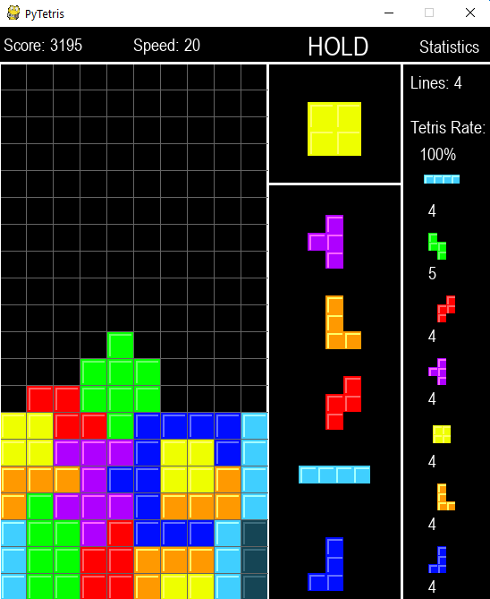

# PyTetris

This is extremely similar to my c++ tetris clone that I made. This one was made in python and uses the pygame module.

Using pygame 1.9.6 instead of the most recent because it handles keypresses better

